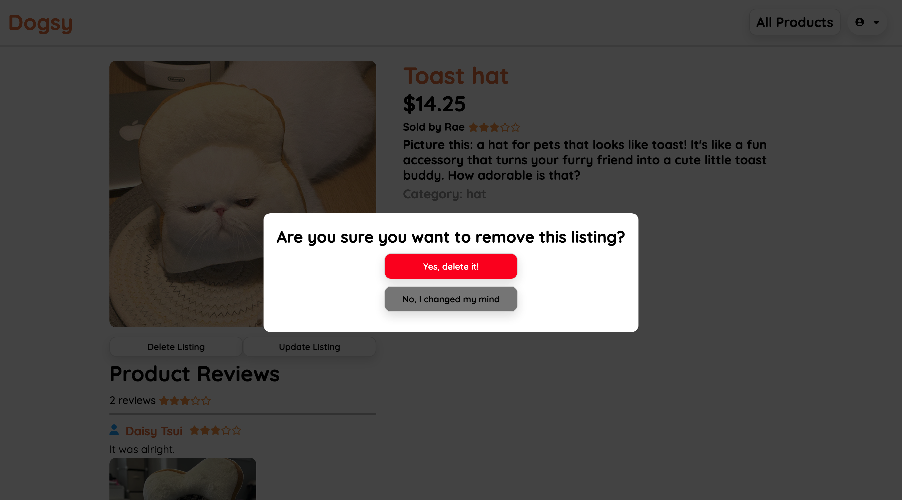

# Full Stack Project

Welcome to Dogsy, an Etsy inspired clone for all pet related items! Feel free to explore the website and check out what our site has to offer for your furry friends. The project was built using Flask for back-end and React for front-end.

**Live Link:**

**Find me on LinkedIn**

## What can you do on Dogsy?

1. Login or Sign Up
   Explore the website as a non-registered and registered user. You may create an account of your own or log in as the demo user for quick access!

2. As a registered user, you can create your own product for sale. Other registered users may leave product reviews on your listing. You can also add pictures to reviews!

## How to download Dogsy on your local computer

1. cd into the root folder and then run `pipenv run flask run` to start the back-end

2. cd into the react-app folder and then run `npm start` to start the front-end

# Site Summary

## Landing Page

This page generates 3 random products to introduce a handful of products available.

## Main Page

- shows list of all available products on the site
- anyone can view this webpage

## Signup

- users can sign up
- invalid information will prompt error messages until user resolves them successfully
- automatically logs in if there are no errors in the sign up form

## Login

- existing users can log in here
- if looking for a quick demo, click to sign in as demo user to explore the site to its fullest extent

## Leave a Product Review

- as a logged in user, leave a review on an item (if user has not already left a previous review)
- each review has the option to add a photo attachment

## Sell a Product

- as a logged in user, create an item for sale

## Edit or Delete the Listing

- user is able to update or delete the listing on the product details page
