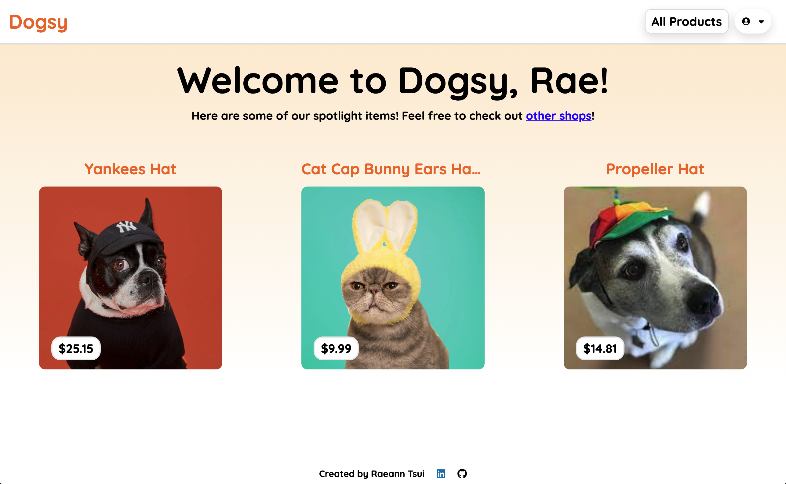
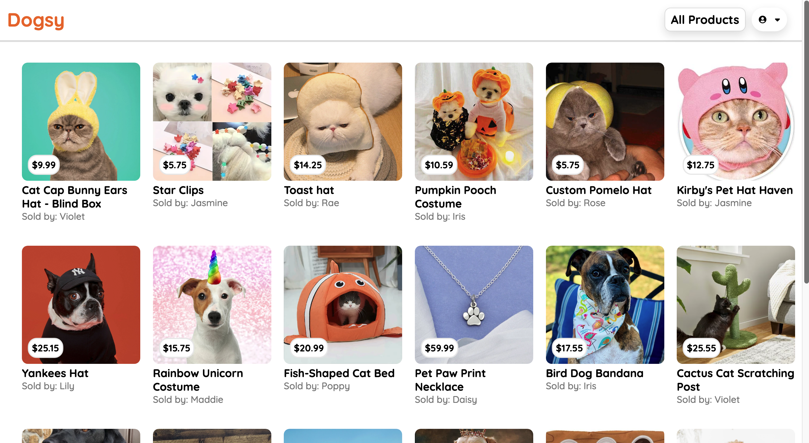
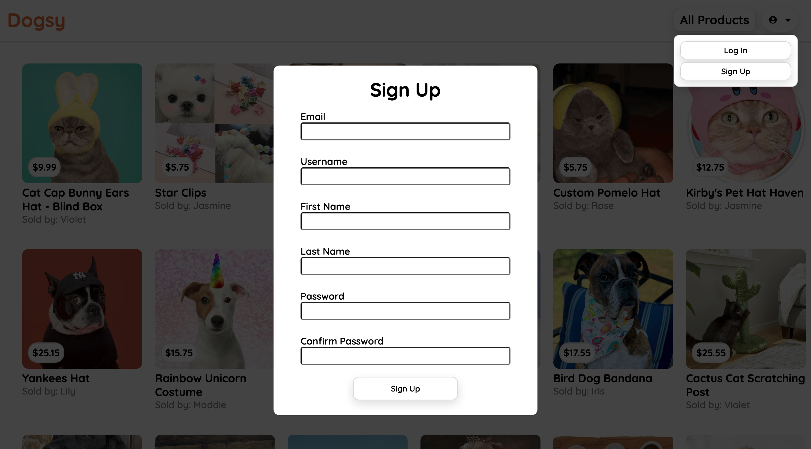
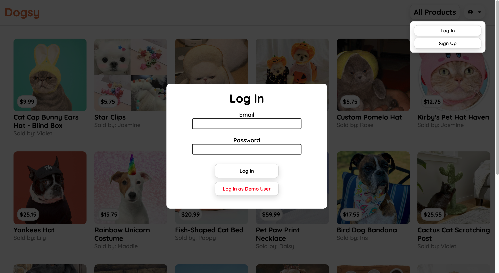
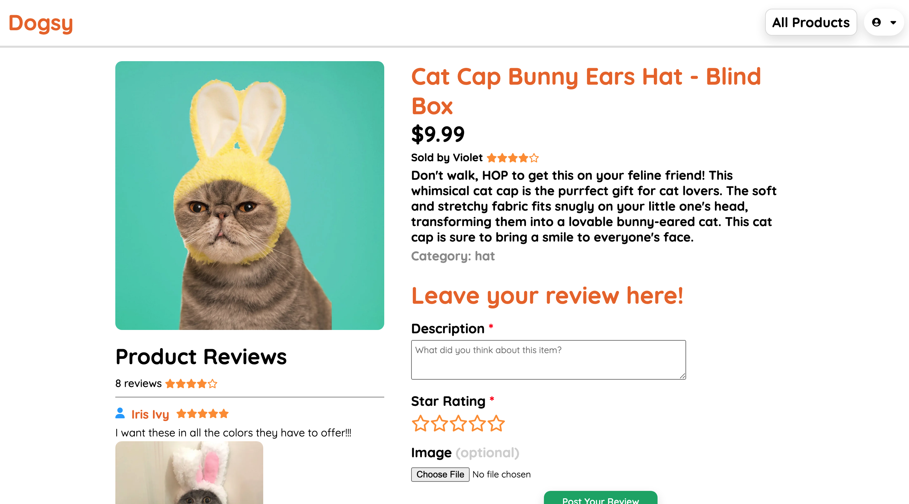
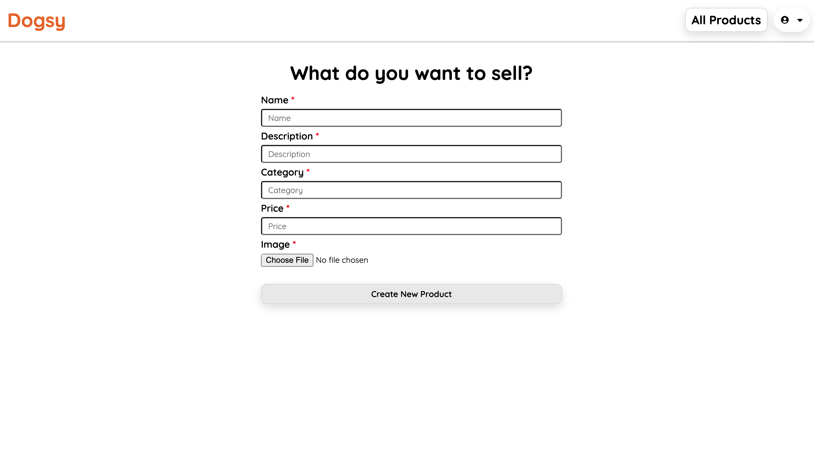
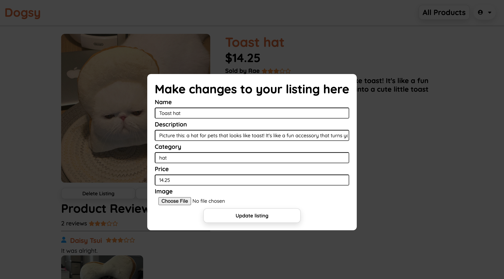

# Raeann's Full Stack Project (Dogsy)

Welcome to Dogsy, an Etsy inspired clone for all pet related items! Feel free to explore the website and check out what our site has to offer for your furry friends. Users can view and review products while browsing Dogsy.The project was built using Flask for back-end and React for front-end.

**Click on the link below to visit the live site!** 

**Check out my LinkedIn profile below:** 

**Languages Used** 

**Site Preview** 

## What can you do on Dogsy?

**1. Explore store listings!** 

- Navigate through the website as either a registered or unregistered user. Create your own account or simply log in as the demo user for quick access!

**2. What are the perks of being a registered user?** 

- Create your own product for sale
- Edit or delete your existing products
- Other users can leave reviews on your existing listings
- You can post reviews on other products listed by other users

## How to download Dogsy on your local computer

1. cd into the root folder and then run `pipenv run flask run` to start the back-end

2. cd into the react-app folder and then run `npm start` to start the front-end

# Site Summary

## Landing Page

- This page generates 3 random products to showcase a preview of the currently available items for purchase

## Main Page

- Click the 'All Products' link to navigate here
- The main page shows list of all available products offered on Dogsy
- Anyone can view this page

## Signup

- Unregistered users can create their own account via the top-right hand corner dropdown menu
- Invalid information will prompt error messages until user resolves them successfully
- Automatically logs the new user in if there are no errors in the sign up form

## Login

- Existing users can log in here
- For a quick demo session, click to sign in as the Demo user to explore the site to its fullest extent (ex. create new listings, manage store, and leave reviews)

## Leave a Product Review

- As a logged in user, leave a review on an item (if user has not already left a previous review)
- Each review requires a description and star rating, but photos are optional
- New reviews are automatically generated on the product page
- If a user would like to update or delete their review, they may do so on the product details page

## Sell a Product

- As a logged in user, create an item for sale
- Each new listing requires a name, description, category, price, and image!

## Edit or Delete the Listing

- User is able to update or delete the listing on the product details page
- Each update requires a name, description, category, price, and image!
